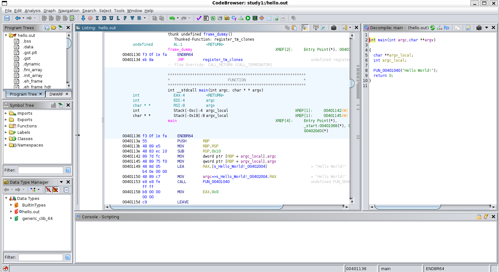

# GHIDRA
- It is reverse engineering tool.

## HOW TO INSTALL

1. visit source code(git)
- https://github.com/NationalSecurityAgency/ghidra

2. download release and unzip
```sh
unzip ghidra_*.zip
```

3. install java jdk 17
```sh
sudo apt update
sudo apt install openjdk-17-jdk
```

4. run ghidra
```sh
./ghidraRun
```

## HOW TO USE

1. make project
- File -> New Project

2. load file
- File -> Import File

3. analyze
